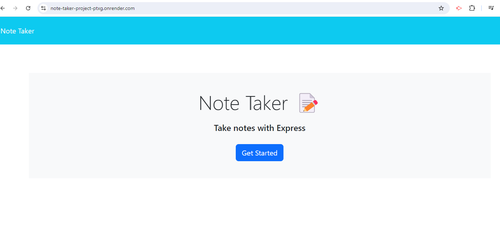
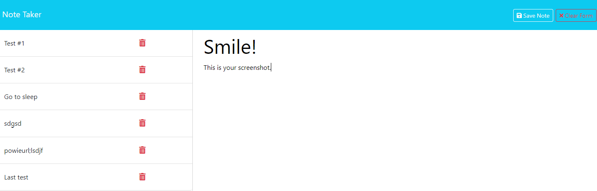
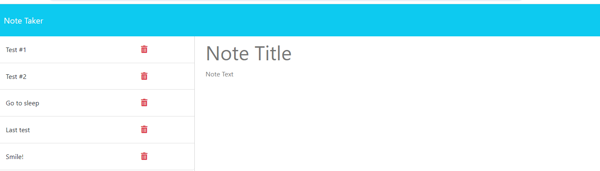

# Note-Taker-project
This application can be used to write, save, and delete notes as needed. It uses an Express.js back end that saves and retrieve note data from a JSON file. 

## Deployed URL  
https://note-taker-project-ptxg.onrender.com

## Application Screenshots  

  

  

  

## Reporting Issues  

If you encounter any issues with the Note-Taker-project, please open an issue or contact ssoto@gmail.com. 

## GitHub repo link  
https://github.com/ssoto83/Note-Taker-project.git

## License  

MIT license.
